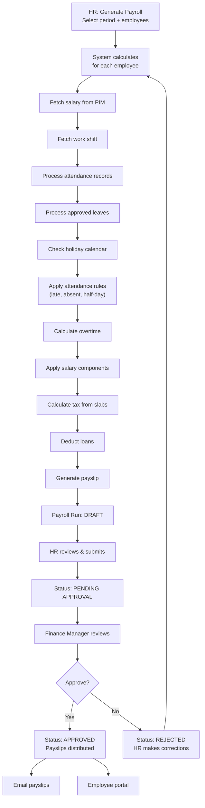

# XHRM Payroll Module — Implementation Plan (v2)

## Overview

A full payroll module for XHRM integrating with existing **Attendance**, **Leave**, **Work Shifts**, and **PIM** modules. Supports multi-currency, flexible pay periods, tax slabs, overtime rules, approval workflow, PDF payslips, and employee self-service.

---

## 1. How It Integrates with Existing XHRM

### Existing Systems We'll Use

| System | Table / Entity | What We Use |
|--------|---------------|-------------|
| **Employee Salary** | `hs_hr_emp_basicsalary` → `EmployeeSalary` | Basic salary, pay grade, currency |
| **Work Shifts** | `ohrm_work_shift` → `WorkShift` | `hours_per_day`, `start_time`, `end_time` |
| **Employee Work Shift** | `ohrm_employee_work_shift` → `EmployeeWorkShift` | Employee → Shift mapping |
| **Attendance** | `ohrm_attendance_record` → `AttendanceRecord` | Punch in/out for calculating hours |
| **Leave** | `ohrm_leave`, `ohrm_leave_request` | Approved leaves for pay period |
| **Modules** | `ohrm_module` → `Module` | Enable/disable Payroll Module toggle |
| **User Roles** | `ohrm_user_role` → `UserRole` | New "Finance Manager" role |
| **Currencies** | `hs_hr_currency_type` → `CurrencyType` | Multi-currency support |

### New Role: Finance Manager

Insert into `ohrm_user_role`:
```sql
INSERT INTO ohrm_user_role (name, display_name, is_assignable, is_predefined)
VALUES ('FinanceManager', 'Finance Manager', 1, 1);
```

**Permissions:** Can access payroll approval, tax settings, financial year config. Cannot access Admin-level settings.

### Module Toggle

Insert into `ohrm_module`:
```sql
INSERT INTO ohrm_module (name, status, display_name)
VALUES ('payroll', 1, 'Payroll Module');
```
This makes the Payroll Module appear in **Admin → Configuration → Module Configuration** with a toggle switch.

---

## 2. Salary & Pay Period System

### 2.1 Pay Period Types (Admin Configurable)

| Type | Calculation Base |
|------|-----------------|
| **Monthly** | Fixed salary ÷ working days |
| **Bi-weekly** | Fixed salary ÷ 2 per month |
| **Weekly** | Fixed salary ÷ 4.33 |
| **Contract** | Fixed amount for contract period |
| **Hourly** | Hours worked × hourly rate |

Admin selects the default pay period type. Each employee can have an override.

### 2.2 Salary Components (Earnings & Deductions)

**Configurable from Admin panel:**

| Component | Type | Example |
|-----------|------|---------|
| Basic Salary | Earning | From PIM salary |
| House Rent Allowance | Earning | 45% of basic (formula) |
| Transport Allowance | Earning | Fixed PKR 5,000 |
| Medical Allowance | Earning | Fixed or % |
| Overtime | Earning | Calculated from attendance |
| Late Deduction | Deduction | Per attendance rules |
| Absent Deduction | Deduction | Per attendance rules |
| Income Tax | Deduction | Per tax slab |
| Loan Installment | Deduction | From loan table |
| EOBI / Social Security | Deduction | Fixed or % |

Each component can be:
- **Fixed amount** (e.g., PKR 5,000)
- **Percentage of basic** (e.g., 45%) 
- **Formula-based** (e.g., `basic * 0.45`)
- **Auto-calculated** (overtime, tax, absent deduction)

---

## 3. Attendance & Overtime Rules

### 3.1 Attendance Rules (Configurable)

Uses the employee's assigned **Work Shift** (`ohrm_work_shift`) for:
- `start_time` → shift start (e.g., 09:00)
- `end_time` → shift end (e.g., 18:00)
- `hours_per_day` → standard hours (e.g., 8)

| Rule | Default | Configurable |
|------|---------|---|
| Grace period | 15 min | ✅ |
| Late threshold | After grace | ✅ |
| Half-day hours | < 4 hours | ✅ |
| Lates → absent conversion | 3 lates = 1 absent | ✅ |
| Working days/week | Mon–Sat (6) | ✅ |

### 3.2 Overtime Rules

| Rule | Default | Configurable |
|------|---------|---|
| Weekday OT rate | 1.5× | ✅ |
| Weekend OT rate | 2.0× | ✅ |
| Holiday OT rate | 2.0× | ✅ |
| Min hours before OT | 8 hrs (from shift) | ✅ |
| Max OT hours/day | 4 hrs | ✅ |
| OT requires approval | No | ✅ |

### 3.3 Calculation per Employee per Period

```
For each working day in pay period:
  1. Check leave records → if approved leave, count as "leave day"
  2. Check attendance → get punch_in, punch_out
  3. Get employee's work shift → start_time, end_time
  
  If (no attendance AND no leave) → ABSENT
  If (punch_in > shift_start + grace_period) → LATE
  If (hours_worked < half_day_threshold) → HALF DAY
  If (hours_worked > shift_hours) → OVERTIME hours = worked - shift_hours
  
  Convert lates: floor(late_count / lates_per_absent) → additional absents
  
  absent_deduction = (basic / working_days) × total_absent_days
  overtime_pay = OT_hours × (basic / working_days / shift_hours) × OT_rate
```

---

## 4. Tax Slabs & Financial Year

### 4.1 Financial Year (Finance Manager configures)

| Field | Example |
|-------|---------|
| Year Label | 2025-2026 |
| Start Date | July 1, 2025 |
| End Date | June 30, 2026 |
| Status | Active / Closed |

### 4.2 Tax Slabs (Pakistan FBR style)

Finance Manager inputs slabs per financial year:

| Annual Income Range | Tax Rate | Fixed Amount |
|---|---|---|
| 0 – 600,000 | 0% | 0 |
| 600,001 – 1,200,000 | 2.5% of excess | 0 |
| 1,200,001 – 2,400,000 | 12.5% of excess | 15,000 |
| 2,400,001 – 3,600,000 | 22.5% of excess | 165,000 |
| 3,600,001 – 6,000,000 | 27.5% of excess | 435,000 |
| Above 6,000,000 | 35% of excess | 1,095,000 |

**Monthly tax** = Annualized salary → slab lookup → divide by 12

---

## 5. Holiday Calendar

HR creates and manages public holidays. Payroll engine uses this to:
- Exclude holidays from "absent" count
- Calculate holiday overtime (2×) if employee worked on a holiday

| Field | Description |
|-------|-------------|
| Name | e.g., "Eid ul Fitr" |
| Date | 2026-03-31 |
| Recurring | Yearly / One-time |
| Applies To | All / Specific department |

---

## 6. Payroll Flow



---

## 7. Database Schema (10 New Tables)

```sql
-- 1. Salary Components
CREATE TABLE xhrm_salary_component (
    id INT AUTO_INCREMENT PRIMARY KEY,
    name VARCHAR(100) NOT NULL,
    code VARCHAR(20) NOT NULL UNIQUE,
    type ENUM('earning', 'deduction') NOT NULL,
    calculation_type ENUM('fixed', 'percentage', 'formula', 'auto') DEFAULT 'fixed',
    default_value DECIMAL(12,2) DEFAULT 0,      -- amount or percentage
    formula VARCHAR(255) NULL,                   -- e.g., 'basic * 0.45'
    is_taxable BOOLEAN DEFAULT TRUE,
    is_active BOOLEAN DEFAULT TRUE,
    sort_order INT DEFAULT 0,
    applies_to ENUM('all', 'monthly', 'hourly', 'contract') DEFAULT 'all'
);

-- 2. Attendance Rules  
CREATE TABLE xhrm_attendance_rule (
    id INT AUTO_INCREMENT PRIMARY KEY,
    name VARCHAR(100) NOT NULL,
    grace_period_minutes INT DEFAULT 15,
    half_day_hours DECIMAL(4,2) DEFAULT 4.00,
    lates_per_absent INT DEFAULT 3,
    working_days JSON DEFAULT '[1,2,3,4,5,6]',  -- 1=Mon, 7=Sun
    is_default BOOLEAN DEFAULT TRUE
);

-- 3. Overtime Rules
CREATE TABLE xhrm_overtime_rule (
    id INT AUTO_INCREMENT PRIMARY KEY,
    name VARCHAR(100) NOT NULL,
    type ENUM('weekday', 'weekend', 'holiday') NOT NULL,
    rate_multiplier DECIMAL(4,2) NOT NULL DEFAULT 1.50,
    min_hours_before_ot DECIMAL(4,2) NULL,      -- NULL = use shift hours
    max_ot_hours_per_day DECIMAL(4,2) DEFAULT 4.00,
    is_active BOOLEAN DEFAULT TRUE
);

-- 4. Financial Year
CREATE TABLE xhrm_financial_year (
    id INT AUTO_INCREMENT PRIMARY KEY,
    label VARCHAR(20) NOT NULL,                 -- '2025-2026'
    start_date DATE NOT NULL,
    end_date DATE NOT NULL,
    status ENUM('active', 'closed') DEFAULT 'active'
);

-- 5. Tax Slabs
CREATE TABLE xhrm_tax_slab (
    id INT AUTO_INCREMENT PRIMARY KEY,
    financial_year_id INT NOT NULL,
    min_income DECIMAL(14,2) NOT NULL,
    max_income DECIMAL(14,2) NULL,             -- NULL = no upper limit
    tax_rate DECIMAL(5,2) NOT NULL,            -- percentage on excess
    fixed_amount DECIMAL(14,2) DEFAULT 0,      -- fixed tax for lower slabs
    FOREIGN KEY (financial_year_id) REFERENCES xhrm_financial_year(id)
);

-- 6. Holiday Calendar
CREATE TABLE xhrm_holiday (
    id INT AUTO_INCREMENT PRIMARY KEY,
    name VARCHAR(100) NOT NULL,
    date DATE NOT NULL,
    is_recurring BOOLEAN DEFAULT FALSE,
    is_half_day BOOLEAN DEFAULT FALSE,
    applies_to ENUM('all', 'department') DEFAULT 'all',
    department_id INT NULL
);

-- 7. Payroll Run
CREATE TABLE xhrm_payroll_run (
    id INT AUTO_INCREMENT PRIMARY KEY,
    period_type ENUM('monthly','biweekly','weekly','contract','hourly') NOT NULL,
    period_start DATE NOT NULL,
    period_end DATE NOT NULL,
    status ENUM('draft','pending_approval','approved','rejected','paid') DEFAULT 'draft',
    generated_by INT NOT NULL,
    generated_at DATETIME NOT NULL,
    approved_by INT NULL,
    approved_at DATETIME NULL,
    rejection_note TEXT NULL,
    total_gross DECIMAL(14,2) DEFAULT 0,
    total_deductions DECIMAL(14,2) DEFAULT 0,
    total_net DECIMAL(14,2) DEFAULT 0,
    employee_count INT DEFAULT 0,
    currency_id VARCHAR(6) NOT NULL DEFAULT 'PKR',
    FOREIGN KEY (generated_by) REFERENCES hs_hr_employee(emp_number),
    FOREIGN KEY (approved_by) REFERENCES hs_hr_employee(emp_number)
);

-- 8. Employee Payslip
CREATE TABLE xhrm_payslip (
    id INT AUTO_INCREMENT PRIMARY KEY,
    payroll_run_id INT NOT NULL,
    emp_number INT NOT NULL,
    pay_period_type VARCHAR(20) NOT NULL,
    basic_salary DECIMAL(12,2) NOT NULL,
    gross_salary DECIMAL(12,2) NOT NULL,
    total_deductions DECIMAL(12,2) DEFAULT 0,
    net_salary DECIMAL(12,2) NOT NULL,
    currency_id VARCHAR(6) NOT NULL DEFAULT 'PKR',
    -- Attendance summary
    total_working_days INT NOT NULL,
    days_present INT DEFAULT 0,
    days_absent INT DEFAULT 0,
    days_leave INT DEFAULT 0,
    days_half INT DEFAULT 0,
    late_count INT DEFAULT 0,
    overtime_hours DECIMAL(6,2) DEFAULT 0,
    overtime_amount DECIMAL(12,2) DEFAULT 0,
    tax_amount DECIMAL(12,2) DEFAULT 0,
    -- Status tracking
    status ENUM('generated','approved','emailed','viewed') DEFAULT 'generated',
    emailed_at DATETIME NULL,
    viewed_at DATETIME NULL,
    FOREIGN KEY (payroll_run_id) REFERENCES xhrm_payroll_run(id),
    FOREIGN KEY (emp_number) REFERENCES hs_hr_employee(emp_number),
    UNIQUE KEY unique_run_emp (payroll_run_id, emp_number)
);

-- 9. Payslip Line Items
CREATE TABLE xhrm_payslip_item (
    id INT AUTO_INCREMENT PRIMARY KEY,
    payslip_id INT NOT NULL,
    component_id INT NULL,
    name VARCHAR(100) NOT NULL,
    type ENUM('earning', 'deduction') NOT NULL,
    amount DECIMAL(12,2) NOT NULL,
    FOREIGN KEY (payslip_id) REFERENCES xhrm_payslip(id) ON DELETE CASCADE,
    FOREIGN KEY (component_id) REFERENCES xhrm_salary_component(id)
);

-- 10. Employee Loans
CREATE TABLE xhrm_employee_loan (
    id INT AUTO_INCREMENT PRIMARY KEY,
    emp_number INT NOT NULL,
    loan_type ENUM('advance', 'loan') NOT NULL,
    description VARCHAR(255) NULL,
    total_amount DECIMAL(12,2) NOT NULL,
    monthly_deduction DECIMAL(12,2) NOT NULL,
    remaining_amount DECIMAL(12,2) NOT NULL,
    start_date DATE NOT NULL,
    status ENUM('active', 'completed', 'cancelled') DEFAULT 'active',
    FOREIGN KEY (emp_number) REFERENCES hs_hr_employee(emp_number)
);
```

---

## 8. Menu & Page Structure

### Sidebar Menu

```
Payroll (NEW top-level)
├── Generate Payroll          -- HR generates for a period
├── Payroll Runs              -- List of all runs + status
├── Approve Payroll           -- Finance Manager approval queue
├── Employee Payslips         -- HR browses all payslips  
├── Loans & Advances          -- Manage employee loans
├── My Payslips               -- Employee self-service (ESS)
└── Holiday Calendar          -- HR manages holidays

Admin → Payroll Settings (NEW)
├── Salary Components         -- Configure earnings/deductions
├── Attendance Rules          -- Configure late/absent rules
├── Overtime Rules            -- Configure OT rates
├── Tax Slabs                 -- Finance Manager: tax slabs per year
└── Financial Year            -- Finance Manager: year config
```

---

## 9. Payslip Design

Each payslip will include:

| Section | Content |
|---------|---------|
| **Header** | Company logo + name, payslip month/year |
| **Employee Info** | Name, ID, designation, department, bank details |
| **Attendance Summary** | Working days, present, absent, late, half-day, OT hours |
| **Earnings** | Basic + all earning components with amounts |
| **Deductions** | Tax + loan + all deduction components |
| **Net Pay** | Gross − Deductions (highlighted) |
| **Footer** | "This is a system-generated payslip" |

**PDF** generated using a PHP library (TCPDF or DomPDF). Company logo comes from **Admin → Corporate Branding**.

---

## 10. Phased Build Plan

### Phase 1 — Foundation & Configuration (~1 week)
- [ ] Create `XHRMPayrollPlugin` skeleton
- [ ] Database migration (all 10 tables)
- [ ] Register module in `ohrm_module` (enable/disable toggle)
- [ ] Create Finance Manager role + permissions
- [ ] Salary Components CRUD (Admin pages)
- [ ] Attendance Rules CRUD
- [ ] Overtime Rules CRUD
- [ ] Holiday Calendar CRUD

### Phase 2 — Financial & Tax (~3-4 days)
- [ ] Financial Year CRUD
- [ ] Tax Slab CRUD (per financial year)
- [ ] Tax calculation engine

### Phase 3 — Payroll Engine (~1-2 weeks)
- [ ] `PayrollCalculationService` — core engine
- [ ] Attendance stats calculation (integrate with existing attendance records)
- [ ] Leave integration (fetch approved leaves)
- [ ] Work shift integration
- [ ] Overtime calculation
- [ ] Salary component application
- [ ] Loan deduction processing
- [ ] Payroll Run generation (Vue page + API)
- [ ] Payroll Run list page

### Phase 4 — Approval, Payslips & Distribution (~1 week)
- [ ] Finance Manager approval workflow
- [ ] Payslip detail page (Vue)
- [ ] My Payslips (employee self-service)
- [ ] PDF payslip generation (with company logo)
- [ ] Email notification on approval
- [ ] Payslip email with PDF attachment

---

## 11. Total File Count Estimate

| Layer | Files | Type |
|-------|-------|------|
| Entities | ~10 | PHP (Doctrine ORM) |
| API Endpoints | ~10 | PHP |
| Controllers | ~8 | PHP |
| Services/Dao | ~6 | PHP |
| Vue Pages | ~15 | Vue.js |
| Vue Components | ~8 | Vue.js |
| Mail Templates | ~3 | Twig/PHP |
| Migration SQL | 1 | SQL |
| Config/Routes | ~3 | PHP/YAML |
| **Total** | **~64 files** | |
